### Escuela Colombiana de Ingeniería
### Arquitecturas de Software - ARSW

### Integrantes
- Laura Natalia Perilla Quintero - [Lanapequin](https://github.com/Lanapequin)
- Santiago Botero Garcia - [LePeanutButter](https://github.com/LePeanutButter)

## Escalamiento en Azure con Maquinas Virtuales, Sacale Sets y Service Plans

### Dependencias
* Cree una cuenta gratuita dentro de Azure. Para hacerlo puede guiarse de esta [documentación](https://azure.microsoft.com/es-es/free/students/). Al hacerlo usted contará con $100 USD para gastar durante 12 meses.

### Parte 0 - Entendiendo el escenario de calidad

Adjunto a este laboratorio usted podrá encontrar una aplicación totalmente desarrollada que tiene como objetivo calcular el enésimo valor de la secuencia de Fibonnaci.

**Escalabilidad**
Cuando un conjunto de usuarios consulta un enésimo número (superior a 1000000) de la secuencia de Fibonacci de forma concurrente y el sistema se encuentra bajo condiciones normales de operación, todas las peticiones deben ser respondidas y el consumo de CPU del sistema no puede superar el 70%.

### Parte 1 - Escalabilidad vertical

1. Diríjase a el [Portal de Azure](https://portal.azure.com/) y a continuación cree una maquina virtual con las características básicas descritas en la imágen 1 y que corresponden a las siguientes:
    * Resource Group = SCALABILITY_LAB
    * Virtual machine name = VERTICAL-SCALABILITY
    * Image = Ubuntu Server
    * Size = Standard B1ls
    * Username = scalability_lab
    * SSH publi key = Su llave ssh publica


2. Para conectarse a la VM use el siguiente comando, donde las `x` las debe remplazar por la IP de su propia VM (Revise la sección "Connect" de la virtual machine creada para tener una guía más detallada).

   `ssh scalability_lab@xxx.xxx.xxx.xxx`

3. Instale node, para ello siga la sección *Installing Node.js and npm using NVM* que encontrará en este [enlace](https://linuxize.com/post/how-to-install-node-js-on-ubuntu-18.04/).
4. Para instalar la aplicación adjunta al Laboratorio, suba la carpeta `FibonacciApp` a un repositorio al cual tenga acceso y ejecute estos comandos dentro de la VM:

   `git clone <your_repo>`

   `cd <your_repo>/FibonacciApp`

   `npm install`

5. Para ejecutar la aplicación puede usar el comando `npm FibinacciApp.js`, sin embargo una vez pierda la conexión ssh la aplicación dejará de funcionar. Para evitar ese compartamiento usaremos *forever*. Ejecute los siguientes comando dentro de la VM.

   ` node FibonacciApp.js`

6. Antes de verificar si el endpoint funciona, en Azure vaya a la sección de *Networking* y cree una *Inbound port rule* tal como se muestra en la imágen. Para verificar que la aplicación funciona, use un browser y user el endpoint `http://xxx.xxx.xxx.xxx:3000/fibonacci/6`. La respuesta debe ser `The answer is 8`.


7. La función que calcula en enésimo número de la secuencia de Fibonacci está muy mal construido y consume bastante CPU para obtener la respuesta. Usando la consola del Browser documente los tiempos de respuesta para dicho endpoint usando los siguintes valores:
    * 1000000
    * 1010000
    * 1020000
    * 1030000
    * 1040000
    * 1050000
    * 1060000
    * 1070000
    * 1080000
    * 1090000

8. Dírijase ahora a Azure y verifique el consumo de CPU para la VM. (Los resultados pueden tardar 5 minutos en aparecer).


9. Ahora usaremos Postman para simular una carga concurrente a nuestro sistema. Siga estos pasos.
    * Instale newman con el comando `npm install newman -g`. Para conocer más de Newman consulte el siguiente [enlace](https://learning.getpostman.com/docs/postman/collection-runs/command-line-integration-with-newman/).
    * Diríjase hasta la ruta `FibonacciApp/postman` en una maquina diferente a la VM.
    * Para el archivo `[ARSW_LOAD-BALANCING_AZURE].postman_environment.json` cambie el valor del parámetro `VM1` para que coincida con la IP de su VM.
    * Ejecute el siguiente comando.

    ```
    newman run ARSW_LOAD-BALANCING_AZURE.postman_collection.json -e [ARSW_LOAD-BALANCING_AZURE].postman_environment.json -n 10 &
    newman run ARSW_LOAD-BALANCING_AZURE.postman_collection.json -e [ARSW_LOAD-BALANCING_AZURE].postman_environment.json -n 10
    ```

10. La cantidad de CPU consumida es bastante grande y un conjunto considerable de peticiones concurrentes pueden hacer fallar nuestro servicio. Para solucionarlo usaremos una estrategia de Escalamiento Vertical. En Azure diríjase a la sección *size* y a continuación seleccione el tamaño `B2ms`.


11. Una vez el cambio se vea reflejado, repita el paso 7, 8 y 9.
12. Evalue el escenario de calidad asociado al requerimiento no funcional de escalabilidad y concluya si usando este modelo de escalabilidad logramos cumplirlo.
13. Vuelva a dejar la VM en el tamaño inicial para evitar cobros adicionales.

### Desarrollo parte 1

#### 1.1 Creación de la Máquina Virtual

Se creó una VM en Azure con las siguientes especificaciones:
- **Resource Group**: SCALABILITY_LAB
- **VM Name**: VERTICAL-SCALABILITY
- **Image**: Ubuntu Server
- **Username**: scalability_lab
- **Authentication**: SSH public key

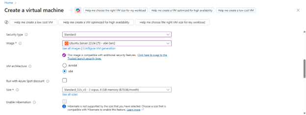

#### 1.2 Conexión a la VM

```bash
ssh -i "VERTICAL-SCALABILITY_key.pem" scalability_lab@172.200.95.109
```

#### 1.3 Instalación de Node.js

Se instaló Node.js versión 18 y npm en Ubuntu utilizando el repositorio oficial de NodeSource:

```bash
curl -fsSL https://deb.nodesource.com/setup_18.x | sudo -E bash –
sudo apt install nodejs
node --version
sudo apt install npm -y
npm --version
```

#### 1.4 Despliegue de la Aplicación

```bash
git clone https://github.com/Lanapequin/ARSW-Lab09-ARSW_LOAD-BALANCING_AZURE.git
cd ARSW-Lab09-ARSW_LOAD-BALANCING_AZURE/FibonacciApp
npm install
```
#### 1.5 Ejecución de la Aplicación

```bash
sudo npm install -g forever
forever start FibonacciApp.js
```

#### 1.6 Configuración de Red

Se creó un **Inbound Port Rule** para permitir tráfico en el puerto 3000:
- **Port**: 3000
- **Protocol**: TCP
- **Action**: Allow

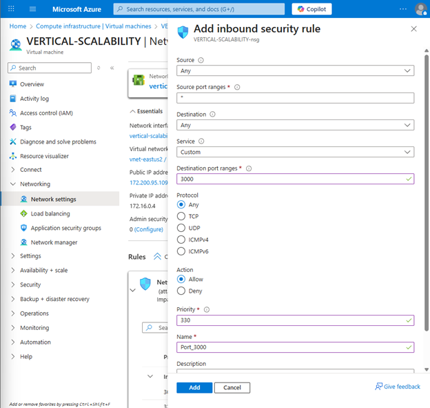

Se utilizo un browser y se uso el endpoint http://172.200.95.109:3000/fibonacci/6

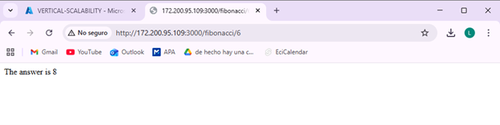

#### 1.7 Pruebas con VM
Se realizaron pruebas con los siguientes valores de Fibonacci:

    * 1000000
    * 1010000
    * 1020000
    * 1030000
    * 1040000
    * 1050000
    * 1060000
    * 1070000
    * 1080000
    * 1090000

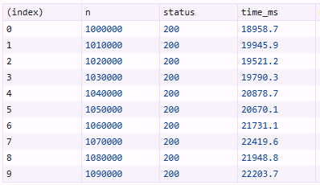

#### 1.8 Consumo de CPU
En general, se observa que el consumo se mantiene cercano a cero la mayor parte del tiempo, lo que indica baja actividad en la VM. Sin embargo, hay un pico significativo que alcanza aproximadamente el 33%, reflejando una carga puntual en el sistema.

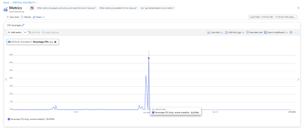

#### 1.9 Pruebas de Carga con Newman

Se instaló Newman para pruebas automatizadas:

```bash
sudo npm install -g newman
newman -v
```

Configuración del archivo de ambiente:
```bash
cd postman/part1
nano '[ARSW_LOAD-BALANCING_AZURE].postman_environment.json'
# Cambiar el valor de VM1 por la IP de la VM
```

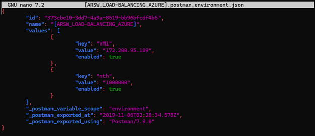

Ejecución de pruebas concurrentes:
```bash
newman run ARSW_LOAD-BALANCING_AZURE.postman_collection.json -e [ARSW_LOAD-BALANCING_AZURE].postman_environment.json -n 10 &
newman run ARSW_LOAD-BALANCING_AZURE.postman_collection.json -e [ARSW_LOAD-BALANCING_AZURE].postman_environment.json -n 10
```


#### 1.10 Escalamiento Vertical a B2ms

Se cambió el tamaño de la VM a **B2ms** desde Azure Portal:
1. Ir a Settings > Size
2. Seleccionar B2ms

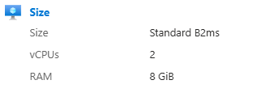

#### 1.11 Pruebas con VM Tamaño B2ms

Se repitieron las pruebas de tiempos de respuesta, consumo de CPU y pruebas de carga con Newman.

**Resultados de tiempos - B2ms**:

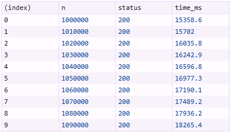

**Consumo de CPU - B2ms**:


**Resultados Newman - B2ms**:

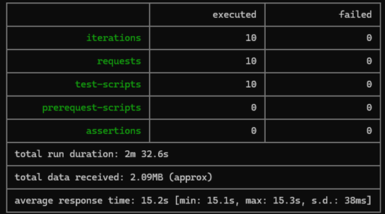

#### 1.12 Evaluación de Escenario de Calidad
Usando este modelo de escalabilidad, sí se cumple el requerimiento no funcional, ya que al aumentar los recursos, el sistema mejora su tiempo de respuesta y estabilidad bajo la misma carga

### **Preguntas**

1. ¿Cuántos y cuáles recursos crea Azure junto con la VM?
2. ¿Brevemente describa para qué sirve cada recurso?
3. ¿Al cerrar la conexión ssh con la VM, por qué se cae la aplicación que ejecutamos con el comando `npm FibonacciApp.js`? ¿Por qué debemos crear un *Inbound port rule* antes de acceder al servicio?
4. Adjunte tabla de tiempos e interprete por qué la función tarda tando tiempo.
5. Adjunte imágen del consumo de CPU de la VM e interprete por qué la función consume esa cantidad de CPU.
6. Adjunte la imagen del resumen de la ejecución de Postman. Interprete:
    * Tiempos de ejecución de cada petición.
    * Si hubo fallos documentelos y explique.
7. ¿Cuál es la diferencia entre los tamaños `B2ms` y `B1ls` (no solo busque especificaciones de infraestructura)?
8. ¿Aumentar el tamaño de la VM es una buena solución en este escenario?, ¿Qué pasa con la FibonacciApp cuando cambiamos el tamaño de la VM?
9. ¿Qué pasa con la infraestructura cuando cambia el tamaño de la VM? ¿Qué efectos negativos implica?
10. ¿Hubo mejora en el consumo de CPU o en los tiempos de respuesta? Si/No ¿Por qué?
11. Aumente la cantidad de ejecuciones paralelas del comando de postman a `4`. ¿El comportamiento del sistema es porcentualmente mejor?

### **Respuestas**

1. Azure junto con la VM crea 6 recursos adicionales:

   | Name | Type |
       |------|------|
   | VERTICAL-SCALABILITY | Virtual machine |
   | vnet-eastus2 | Virtual network |
   | VERTICAL-SCALABILITY-nsg | Network security group |
   | VERTICAL-SCALABILITY-ip | Public IP address |
   | vertical-scalability676 | Network interface |
   | SCALABILITY_LAB | Resource group |

2. **Función de cada recurso**

- **Virtual Machine**: Es el servidor virtual donde se ejecuta la aplicación.
- **Virtual Network**: Red privada que permite la comunicación segura entre la VM y otros recursos de Azure.
- **Network Interface**: Interfaz de red que conecta la VM a la VNet.
- **Public IP Address**: IP pública para acceder a la VM desde Internet.
- **Network Security Group**: Firewall que controla el tráfico de entrada/salida de la VM.
- **Resource Group**: Contenedor lógico que agrupa todos los recursos del laboratorio.

3. El comando npm FibonacciApp.js inicia un proceso que depende de una conexión activa para funcionar. Si dicha conexión se interrumpe, la aplicación se detiene y deja de operar.
   Es necesario crear una Inbound port rule para permitir el tráfico entrante en el puerto 3000, ya que Azure bloquea por defecto todo el tráfico de entrada, y este puerto debe estar habilitado para que la aplicación pueda ejecutarse correctamente.

4. **Antes del escalamiento:**

   

   **Despues del escalamiento:**

   

   La función Fibonacci implementa recursivamente f(n) = f(n-1) + f(n-2) tiene complejidad exponencial O(2^n), por lo cual, cada número alto genera millones de llamadas recursivas, por eso los tiempos de respuesta son muy altos.

5. **Antes del escalamiento:**

   

   **Despues del escalamiento:**

   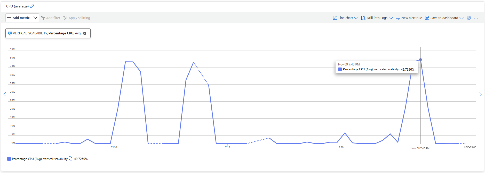

   La recursividad hace que la CPU trabaje intensamente calculando Fibonacci, por eso los tiempos de respuesta son altos y la CPU se satura.

6. **Antes del escalamiento:**

   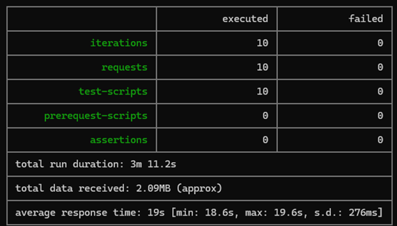

   **Despues del escalamiento:**

   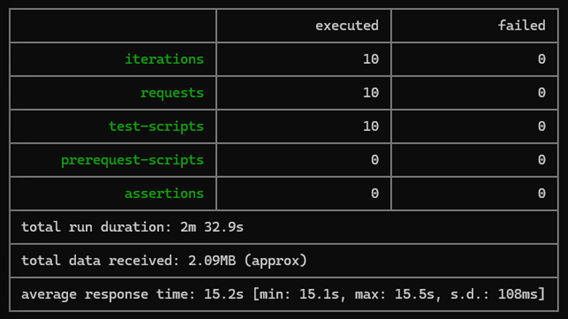

   Tras aumentar el tamaño de la VM, el tiempo promedio se redujo de 19 segundos a 15.2 segundos, esto demuestra que al tener más núcleos y memoria, la VM puede ejecutar el proceso con menor latencia.

7. **Comparación B1ls vs B2ms**

   | Característica | B1ls                            | B2ms |
       |---------------|---------------------------------|------|
   | **vCPUs** | 1                               | 2 |
   | **RAM** | 0.5 GB                          | 8 GB |
   | **Uso típico** | Pruebas básicas, microservicios | Aplicaciones de carga moderada |
   | **Rendimiento** | Muy bajo                        | Medio-alto |
   | **Precio** | Bajo                            | Moderado  |

**Diferencia clave**: No solo cambia el hardware, el B2ms permite más procesos concurrentes y estabilidad bajo carga, mientras que el B1ls puede bloquearse fácilmente.

8. Aumentar el tamaño de la VM mejora el rendimiento temporalmente porque se asignan más recursos como CPU y memoria, reduciendo los tiempos de ejecución. Sin embargo, no es una solución escalable ni costo-eficiente, ya que solo beneficia a una máquina y tiene límites físicos y económicos.
   Al cambiar el tamaño de la VM, la FibonacciApp responde más rápido porque dispone de mayor capacidad de procesamiento, lo que reduce el tiempo promedio de respuesta.

9. Cuando se cambia el tamaño:
    - Azure detiene la VM temporalmente.
    - Reasigna CPU y memoria según el nuevo tamaño.

   Efectos negativos:
    - Se pierde la sesión SSH.
    - Los procesos activos se interrumpen.
    - Riesgo de pérdida de datos si algo no fue guardado.

10. Si, ya que al ampliar el tamaño de la máquina virtual se incrementan los recursos disponibles, como la cantidad de CPU y memoria RAM, lo que permite que la aplicación maneje un mayor número de solicitudes con mayor rapidez y eficiencia.

11. **Aumento de cantidad de ejecuciones paralelas**

La VM actual no soporta bien más carga concurrente, incluso después del escalamiento vertical, ya que al aumentar las ejecuciones paralelas, la VM recibe más carga simultáneamente y como la CPU y la memoria de la VM son limitadas, esto provoca que cada request tarde más porque las solicitudes compiten por los recursos, por lo tanto, el comportamiento del sistema no es porcentualmente mejor.

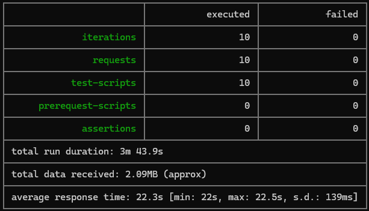

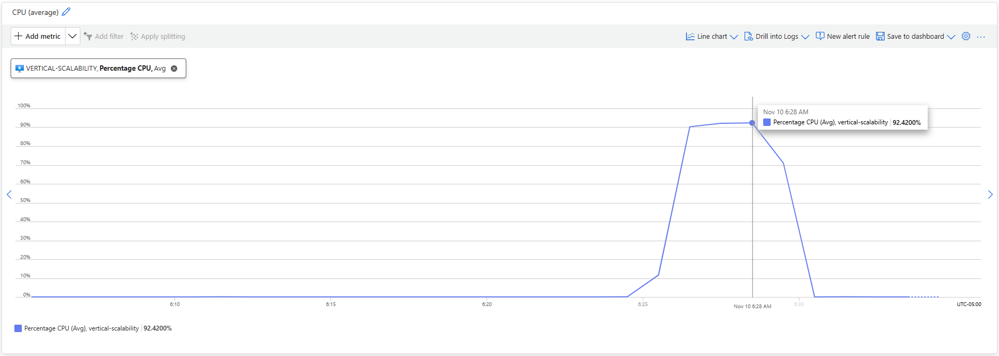

### Parte 2 - Escalabilidad horizontal

#### Crear el Balanceador de Carga

Antes de continuar puede eliminar el grupo de recursos anterior para evitar gastos adicionales y realizar la actividad en un grupo de recursos totalmente limpio.

1. El Balanceador de Carga es un recurso fundamental para habilitar la escalabilidad horizontal de nuestro sistema, por eso en este paso cree un balanceador de carga dentro de Azure tal cual como se muestra en la imágen adjunta.


2. A continuación cree un *Backend Pool*, guiese con la siguiente imágen.


3. A continuación cree un *Health Probe*, guiese con la siguiente imágen.


4. A continuación cree un *Load Balancing Rule*, guiese con la siguiente imágen.


5. Cree una *Virtual Network* dentro del grupo de recursos, guiese con la siguiente imágen.


#### Crear las maquinas virtuales (Nodos)

Ahora vamos a crear 3 VMs (VM1, VM2 y VM3) con direcciones IP públicas standar en 3 diferentes zonas de disponibilidad. Después las agregaremos al balanceador de carga.

1. En la configuración básica de la VM guíese por la siguiente imágen. Es importante que se fije en la "Avaiability Zone", donde la VM1 será 1, la VM2 será 2 y la VM3 será 3.


2. En la configuración de networking, verifique que se ha seleccionado la *Virtual Network*  y la *Subnet* creadas anteriormente. Adicionalmente asigne una IP pública y no olvide habilitar la redundancia de zona.


3. Para el Network Security Group seleccione "avanzado" y realice la siguiente configuración. No olvide crear un *Inbound Rule*, en el cual habilite el tráfico por el puerto 3000. Cuando cree la VM2 y la VM3, no necesita volver a crear el *Network Security Group*, sino que puede seleccionar el anteriormente creado.


4. Ahora asignaremos esta VM a nuestro balanceador de carga, para ello siga la configuración de la siguiente imágen.


5. Finalmente debemos instalar la aplicación de Fibonacci en la VM. para ello puede ejecutar el conjunto de los siguientes comandos, cambiando el nombre de la VM por el correcto

```
git clone https://github.com/daprieto1/ARSW_LOAD-BALANCING_AZURE.git

curl -o- https://raw.githubusercontent.com/creationix/nvm/v0.34.0/install.sh | bash
source /home/vm1/.bashrc
nvm install node

cd ARSW_LOAD-BALANCING_AZURE/FibonacciApp
npm install

npm install forever -g
forever start FibonacciApp.js
```

Realice este proceso para las 3 VMs, por ahora lo haremos a mano una por una, sin embargo es importante que usted sepa que existen herramientas para aumatizar este proceso, entre ellas encontramos Azure Resource Manager, OsDisk Images, Terraform con Vagrant y Paker, Puppet, Ansible entre otras.

#### Probar el resultado final de nuestra infraestructura

1. Porsupuesto el endpoint de acceso a nuestro sistema será la IP pública del balanceador de carga, primero verifiquemos que los servicios básicos están funcionando, consuma los siguientes recursos:

```
http://52.155.223.248/
http://52.155.223.248/fibonacci/1
```

2. Realice las pruebas de carga con `newman` que se realizaron en la parte 1 y haga un informe comparativo donde contraste: tiempos de respuesta, cantidad de peticiones respondidas con éxito, costos de las 2 infraestrucruras, es decir, la que desarrollamos con balanceo de carga horizontal y la que se hizo con una maquina virtual escalada.

3. Agregue una 4 maquina virtual y realice las pruebas de newman, pero esta vez no lance 2 peticiones en paralelo, sino que incrementelo a 4. Haga un informe donde presente el comportamiento de la CPU de las 4 VM y explique porque la tasa de éxito de las peticiones aumento con este estilo de escalabilidad.

```
newman run ARSW_LOAD-BALANCING_AZURE.postman_collection.json -e [ARSW_LOAD-BALANCING_AZURE].postman_environment.json -n 10 &
newman run ARSW_LOAD-BALANCING_AZURE.postman_collection.json -e [ARSW_LOAD-BALANCING_AZURE].postman_environment.json -n 10 &
newman run ARSW_LOAD-BALANCING_AZURE.postman_collection.json -e [ARSW_LOAD-BALANCING_AZURE].postman_environment.json -n 10 &
newman run ARSW_LOAD-BALANCING_AZURE.postman_collection.json -e [ARSW_LOAD-BALANCING_AZURE].postman_environment.json -n 10
```

### Desarrollo parte 2

#### 2.1 Creación del Load Balancer

Se creó un Azure Load Balancer con las siguientes características:
- **Name**: SCALABILITY_LAB_LOAD_BALANCER
- **Type**: Public
- **SKU**: Standard
- **Tier**: Regional

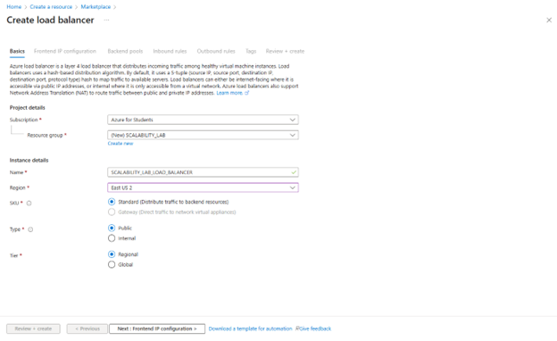

#### 2.2 Configuración del Backend Pool

El Backend Pool agrupa las VMs que recibirán tráfico del balanceador:

```
Name: SCALABILITY_LAB_BACKEND_POOL
Virtual Network: SCALABILITY_LAB_VIRTUAL_NETWORK
```

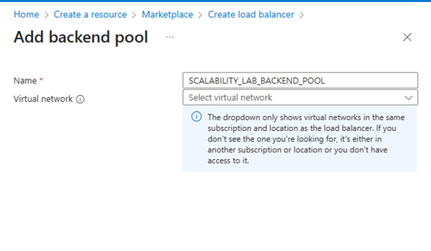

#### 2.3 Configuración del Health Probe

El Health Probe monitorea la salud de las VMs:

```
Name: SCALABILITY_LAB_HEALTH_PROBE
Protocol: TCP
Port: 3000
Path: /
Interval: 5 seconds
```

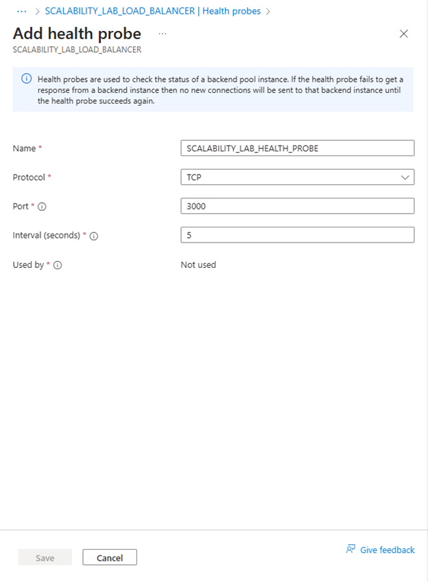

#### 2.4 Configuración de Load Balancing Rule

Define cómo se distribuye el tráfico:

```
Name: SCALABILITY_LAB_LOAD_BALANCING_RULE
IP Version: IPv4
Backend Pool: SCALABILITY_LAB_BACKEND_POOL
Port: 80
Backend Port: 3000
Health Probe: SCALABILITY_LAB_HEALTH_PROBE
Session Persistence: None
```

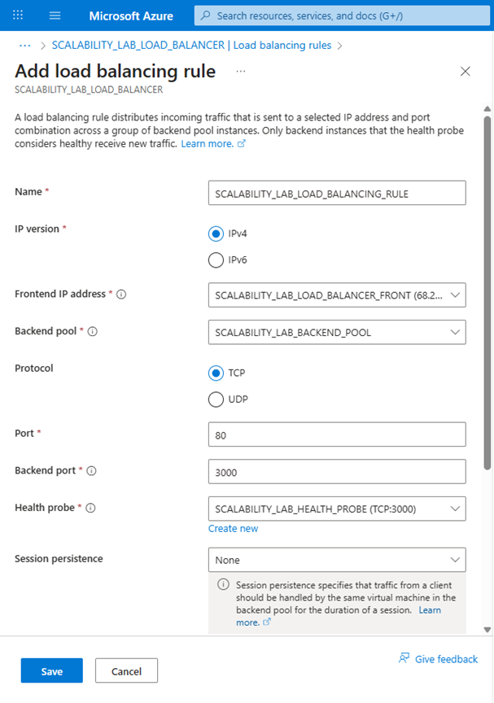

#### 2.5 Creación de Virtual Network

```
Name: SCALABILITY_LAB_VIRTUAL_NETWORK
Address Space: 10.1.0.0/16
Subnet Name: SCALABILITY_LAB_SUBNET
Subnet Range: 10.1.0.0/24
```

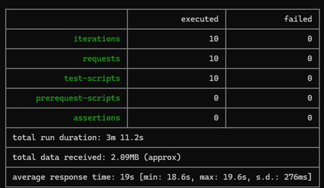

#### 2.6 Creación de las Máquinas Virtuales

Se crearon 2 VMs idénticas en diferentes zonas de disponibilidad:

##### VM1 - Zona 1
```
Name: VM1
Size: Standard B2s
Availability Zone: 1
Virtual Network: SCALABILITY_LAB_VIRTUAL_NETWORK
Subnet: SCALABILITY_LAB_SUBNET
Public IP: VM1-ip
Network Security Group: LOAD_BALANCER_NSG
Load Balancer: SCALABILITY_LAB_LOAD_BALANCER
Backend Pool: SCALABILITY_LAB_BACKEND_POOL
```

##### VM2 - Zona 2
```
Name: VM2
Size: Standard B2s
Availability Zone: 2
Virtual Network: SCALABILITY_LAB_VIRTUAL_NETWORK
Subnet: SCALABILITY_LAB_SUBNET
Public IP: VM2-ip
Network Security Group: LOAD_BALANCER_NSG
Load Balancer: SCALABILITY_LAB_LOAD_BALANCER
Backend Pool: SCALABILITY_LAB_BACKEND_POOL
```

#### 2.7 Instalación de la Aplicación en las VMs

Se ejecutaron los siguientes comandos en cada una de las VMs:

```bash
# Conectar a la VM
ssh -i "KEY_DE_LA_VM.pem" vm@IP_VM

# Clonar el repositorio
git clone https://github.com/daprieto1/ARSW_LOAD-BALANCING_AZURE.git

# Instalar Node.js con NVM
curl -fsSL https://deb.nodesource.com/setup_18.x | sudo -E bash –
sudo apt install nodejs
node --version
sudo apt install npm -y
npm --version

# Instalar dependencias de la aplicación
cd ARSW_LOAD-BALANCING_AZURE/FibonacciApp
npm install

# Instalar y ejecutar con forever
npm install forever -g
forever start FibonacciApp.js

# Verificar que la aplicación está corriendo
forever list
```

#### 2.8 Pruebas del Sistema con Load Balancer

Se realizo la verificación de servicios básicos

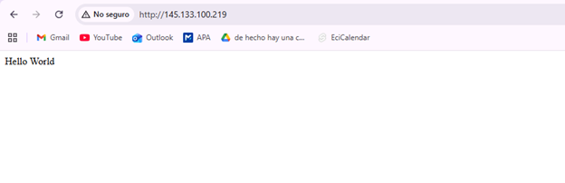

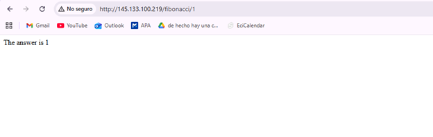

#### 2.9 Pruebas de carga con Newman

Se realizaron las pruebas de carga con Newman

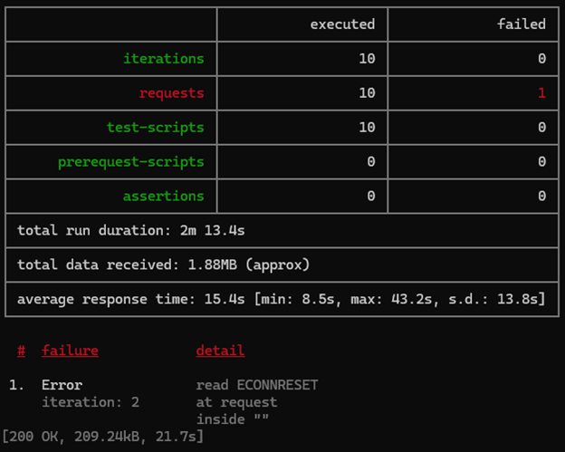

En la infraestructura con escalamiento vertical, las pruebas con Newman mostraron un tiempo promedio de respuesta de 15.2 s, sin fallos en las 10 peticiones, pero con una duración total mayor (2m 32.6s) y un consumo de datos de 2.09 MB; en cambio, con escalamiento horizontal (balanceo en varias VM), el tiempo promedio fue similar (15.4 s), pero la ejecución terminó más rápido (2m 13.4s) y se redujo el volumen de datos (1.88 MB), aunque se presentó 1 fallo por ECONNRESET, lo que indica que la distribución de carga mejora la velocidad global pero introduce complejidad en la conexión. En términos de costos, el escalamiento vertical implica pagar por una sola máquina más potente, mientras que el horizontal requiere varias instancias más pequeñas, lo que suele ser más eficiente para alta concurrencia porque permite repartir la carga y escalar dinámicamente, reduciendo saturación y mejorando la resiliencia del sistema.

#### 2.10 Pruebas con 4 Instancias Paralelas

Al incrementar las peticiones concurrentes de 2 a 4 y distribuirlas en dos máquinas virtuales, el uso de CPU se estabilizó porque la carga se repartió entre más recursos, evitando saturación en cada VM; esto redujo tiempos de respuesta.

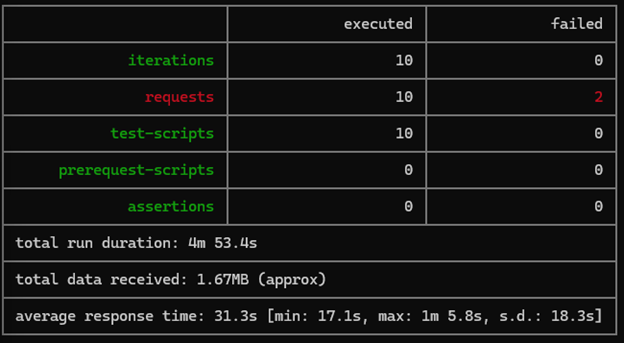

**Comportamiento de la CPU:**

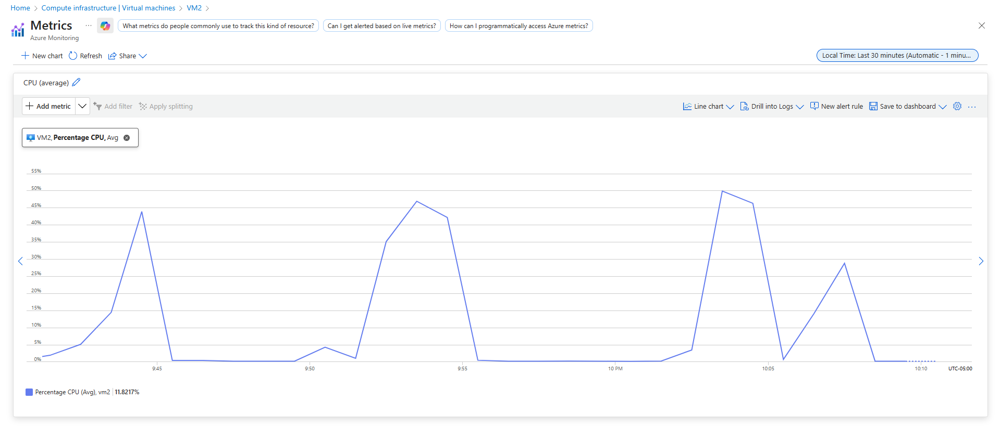
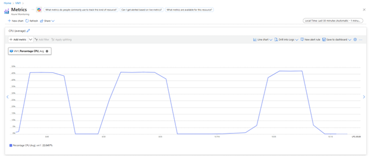


### **Preguntas**

1. * ¿Cuáles son los tipos de balanceadores de carga en Azure y en qué se diferencian?, ¿Qué es SKU, qué tipos hay y en qué se diferencian?, ¿Por qué el balanceador de carga necesita una IP pública?
2. * ¿Cuál es el propósito del *Backend Pool*?
3. * ¿Cuál es el propósito del *Health Probe*?
4. * ¿Cuál es el propósito de la *Load Balancing Rule*? ¿Qué tipos de sesión persistente existen, por qué esto es importante y cómo puede afectar la escalabilidad del sistema?.
5. * ¿Qué es una *Virtual Network*? ¿Qué es una *Subnet*? ¿Para qué sirven los *address space* y *address range*?
6. * ¿Qué son las *Availability Zone* y por qué seleccionamos 3 diferentes zonas?. ¿Qué significa que una IP sea *zone-redundant*?
7. * ¿Cuál es el propósito del *Network Security Group*?
8. * Informe de newman 1 (Punto 2)
9. * Presente el Diagrama de Despliegue de la solución.

### **Respuestas**
1. **Balanceadores de Carga de Azure, SKU e IP Pública**
   **Tipos de Balanceadores de Carga en Azure y sus Diferencias**  
   Azure Load Balancer es un servicio de capa 4 (TCP, UDP) que distribuye el tráfico entre máquinas virtuales. Existen dos tipos principales definidos por la dirección IP de frontend:

    * **Load Balancer Público:** Asigna una dirección IP pública y puerto del tráfico de entrada a la IP privada y puerto de una máquina virtual en el backend pool (Microsoft, n.d.-a, "Componentes de Azure Load Balancer"). Se utiliza para equilibrar la carga del tráfico entrante desde Internet [(Mbender-Ms, n.d.-b)](#comp).
    * **Load Balancer Interno:** Asigna una dirección IP privada y puerto a una máquina virtual. Se usa para equilibrar la carga del tráfico dentro de una red virtual o para acceder desde una red local en un escenario híbrido [(Mbender-Ms, n.d.-b)](#comp).

   **Qué es SKU, qué tipos hay y en qué se diferencian**  
   SKU (Stock Keeping Unit), en el contexto de Azure Load Balancer, define el conjunto de características, escala, disponibilidad, seguridad y precio del servicio [(Mbender-Ms, n.d.-b)](#sku).

   | SKU                          | Escenario Típico                                                                 | Tipo de Backend     | Zonas de Disponibilidad                   | Características de Seguridad                                                                                                                           |
       |------------------------------|----------------------------------------------------------------------------------|---------------------|-------------------------------------------|--------------------------------------------------------------------------------------------------------------------------------------------------------|
   | Básico (Retirada programada) | Aplicaciones de pequeña escala sin necesidad de alta disponibilidad/redundancia. | Basado en NIC.      | No disponible.                            | Abierto a Internet por defecto.                                                                                                                        |
   | Estándar                     | Alto rendimiento y latencia ultrabaja. Tráfico de capa de red. Alta resistencia. | Basado en IP o NIC. | Compatible (redundancia de zona o zonal). | Cerrado a conexiones entrantes por defecto; requiere Grupos de Seguridad de Red (NSG) para permitir tráfico (Microsoft, n.d.-b, "Comparación de SKU"). |

   [(Mbender-Ms, n.d.-b)](#sku).

   **Por qué el balanceador de carga necesita una IP pública**  
   Un Load Balancer Público necesita una Dirección IP Pública porque esta es el punto de contacto de los clientes que se originan en Internet [(Mbender-Ms, n.d.-b)](#out).

    * La IP pública permite la conectividad de Internet de entrada (para que los clientes externos puedan acceder) y la conectividad de Internet de salida (para que las instancias del backend puedan comunicarse con Internet) [(Mbender-Ms, n.d.-b)](#out).
    * Si se selecciona una Dirección IP privada, se crea un Load Balancer Interno, que no es accesible desde Internet [(Mbender-Ms, n.d.-b)](#out).

2. **Propósito del Backend Pool**  
   El propósito del Backend Pool (Grupo de Back-end) es agrupar las instancias de servicio (como Máquinas Virtuales o Conjuntos de Escala de Máquinas Virtuales) que recibirán el tráfico equilibrado por el Load Balancer [(Mbender-Ms, n.d.-b)](#pool).

    * El Load Balancer distribuye equitativamente las solicitudes entrantes a estas instancias agrupadas según las reglas definidas [(Mbender-Ms, n.d.-b)](#pool).
    * Los protocolos de enlace (como TCP/TLS) ocurren directamente entre el cliente y las instancias del Backend Pool. El Load Balancer no interactúa con la carga de TCP, permitiendo la escalabilidad horizontal de aplicaciones cifradas [(Mbender-Ms, n.d.-b)](#pool).

3. **Propósito del Health Probe**  
   El propósito del Health Probe (Sondeo de Estado) es detectar el estado de mantenimiento de las instancias de la aplicación en el Backend Pool [(Mbender-Ms, n.d.-b)](#probe).

    * Envía solicitudes (usando protocolos como TCP, HTTP o HTTPS) a las instancias para verificar si están disponibles y respondiendo a las solicitudes [(Mbender-Ms, n.d.-b)](#probe).
    * Las reglas del Load Balancer requieren un sondeo de estado. Si un sondeo falla, el Load Balancer deja de enviar nuevas conexiones a la instancia con estado incorrecto, asegurando que el tráfico solo se dirija a instancias correctas y ayudando a la alta disponibilidad y a detectar errores de la aplicación [(Mbender-Ms, n.d.-b)](#probe).

4. **Load Balancing Rule y Sesión Persistente**
   **Propósito de la Load Balancing Rule**  
   Una Load Balancing Rule es la columna vertebral de la administración de tráfico que dicta cómo las solicitudes entrantes se distribuyen uniformemente entre las instancias del Backend Pool [(KodeKloud Notes, n.d.)](#rules).

    * Una regla enlaza un Frontend IP (dirección IP del balanceador) y un puerto a un Backend Pool y su puerto, especificando el protocolo (TCP o UDP) y el sondeo de estado a utilizar [(KodeKloud Notes, n.d.)](#rules).
    * La distribución se realiza por flujo, basándose en una tupla de cinco elementos: dirección IP de origen, puerto de origen, dirección IP de destino, puerto de destino y tipo de protocolo [(KodeKloud Notes, n.d.)](#rules).

   **Tipos de Sesión Persistente**  
   La sesión persistente (o afinidad de sesión) asegura que las solicitudes de un cliente se dirijan consistentemente a la misma instancia de back-end. Azure Load Balancer ofrece tres tipos [(Persistencia De Sesiones Del Equilibrador De Carga, n.d.)](#persistance):

    1. Ninguna (None): Sin persistencia. El tráfico puede ir a cualquier instancia de back-end en cada nuevo flujo (por defecto).
    2. IP de Cliente (Client IP): La afinidad se basa en la dirección IP de origen del cliente. Todas las solicitudes del mismo cliente van a la misma instancia de back-end.
    3. IP de Cliente y Protocolo (Client IP and Protocol): La afinidad se basa en la tupla de dirección IP de origen del cliente y protocolo.

   **Importancia y Afectación a la Escalabilidad:**
    * Importancia: Es crucial cuando la aplicación requiere mantener el estado o contexto del usuario a través de solicitudes secuenciales (por ejemplo, carritos de compra, sesiones de inicio de sesión) sin usar un almacén de estado compartido o una base de datos externa [(Persistencia De Sesiones Del Equilibrador De Carga, n.d.)](#persistance).
    * Afectación a la Escalabilidad: La persistencia de sesión puede reducir la escalabilidad horizontal efectiva del sistema (Oracle, n.d., "Persistencia de sesiones del equilibrador de carga"). Al forzar que el tráfico de un cliente vaya a una única instancia, se puede crear un desequilibrio de carga donde algunas instancias reciben más tráfico que otras, limitando la capacidad general de la aplicación para escalar uniformemente [(Persistencia De Sesiones Del Equilibrador De Carga, n.d.)](#persistance).

5. **Virtual Network, Subnet y Espacios de Direcciones**  
   **¿Qué es una Virtual Network?**  
   Una Azure Virtual Network (VNet) es el bloque de construcción fundamental para tu red privada en Azure. Es un servicio que te permite aprovisionar una red privada y que muchos tipos de recursos de Azure (como máquinas virtuales) se comuniquen de forma segura entre sí, con Internet y con redes locales. Es análoga a una red tradicional que operarías en tu propio centro de datos [(Azure Virtual Network – Nube Privada Virtual | Microsoft Azure, n.d.)](#virtual).

   **¿Qué es una Subnet?**  
   Una Subnet (Subred) es una división lógica dentro de una VNet [(Yujiang, n.d.)](#subnet).

    * Cada VNet se puede segmentar en una o más subredes.
    * Una subred contiene un rango de direcciones (address range) único dentro del address space de la VNet y no puede superponerse con otras subredes dentro de la misma VNet [(Yujiang, n.d.)](#subnet).
    * Las subredes permiten la segmentación de red y la aplicación de controles de seguridad (como Grupos de Seguridad de Red) a diferentes grupos de recursos [(Yujiang, n.d.)](#subnet).

   **¿Para qué sirven los address space y address range?**
    * Address Space (Espacio de Direcciones): Es el rango total de direcciones IP privadas que se asigna a una Virtual Network (VNet). Es el bloque de direcciones CIDR principal (por ejemplo, 10.0.0.0/16) dentro del cual se crearán todas las subredes (Microsoft, n.d.-i). Su propósito es definir el alcance de las direcciones privadas para los recursos dentro de la VNet.
    * Address Range (Rango de Direcciones): Es un rango de direcciones IP dentro del Address Space de la VNet que se asigna a una Subnet (por ejemplo, 10.0.1.0/24). Su propósito es asignar un conjunto de direcciones únicas para los recursos dentro de esa subred específica. El rango no debe superponerse con otros rangos de subred dentro de la VNet [(Asudbring, n.d.)](#address).

6. **Availability Zone y Selección**  
   **¿Qué son las Availability Zone?**  
   Las Availability Zones (Zonas de Disponibilidad) son ubicaciones físicas únicas aisladas de fallos dentro de una región de Azure [(Jasminemehndir, n.d.)](#zones).

    * Cada Zona de Disponibilidad se compone de uno o más centros de datos con alimentación, refrigeración y redes independientes [(Jasminemehndir, n.d.)](#zones).
    * Las regiones habilitadas para Zonas de Disponibilidad tienen un mínimo de tres zonas independientes para garantizar la resistencia [(Jasminemehndir, n.d.)](#zones).

   **¿Por qué seleccionamos 3 diferentes zonas?**  
   Seleccionamos tres (o más) Zonas de Disponibilidad porque es la cantidad mínima requerida para lograr la redundancia de zona completa en Azure [(Elegir La Región De Azure Correspondiente | Microsoft Azure, n.d.)](#regions).

    * La arquitectura de tres zonas garantiza la tolerancia a fallos. Si una zona entera falla (debido a un desastre o fallo de centro de datos), las otras dos zonas continúan operando el servicio, manteniendo la disponibilidad del 99.99% o superior para muchos servicios [(Elegir La Región De Azure Correspondiente | Microsoft Azure, n.d.)](#regions).
    * Esta configuración protege contra la pérdida de una sola zona y asegura que el servicio pueda escalar y permanecer disponible sin intervención manual [(Elegir La Región De Azure Correspondiente | Microsoft Azure, n.d.)](#regions).

   **¿Qué significa que una IP sea zone-redundant?**  
   Que una dirección IP pública sea zone-redundant (redundante de zona) significa que la dirección IP no está asociada a ninguna Zona de Disponibilidad específica; en su lugar, está distribuida y puede fallar por conmutación (failover) entre cualquiera de las zonas habilitadas dentro de la región [(Mbender-Ms, n.d.-b)](#ip).

    * Propósito: Este tipo de IP pública proporciona la máxima disponibilidad para los servicios (como un Balanceador de Carga Estándar). Si una zona deja de estar disponible, la IP pública permanece accesible a través de las zonas restantes [(Mbender-Ms, n.d.-b)](#ip).
    * Diferencia: Se opone a una IP zonal (o de zona), que se crea para vivir y fallar por conmutación dentro de una zona específica.

7. **Propósito del Network Security Group (NSG)**  
   El propósito principal de un Network Security Group (NSG) es filtrar el tráfico de red hacia y desde los recursos de Azure en una Virtual Network (VNet) [(Asudbring, n.d.-b)](#security).  
   El NSG actúa como un firewall virtual a nivel de red (Capa 3 y 4), controlando el flujo de datos mediante reglas de seguridad que permiten o deniegan el tráfico basado en una tupla de cinco elementos:

    * Dirección IP de origen
    * Puerto de origen
    * Dirección IP de destino
    * Puerto de destino
    * Protocolo (TCP, UDP, ICMP o Any)

   **Usos Clave**
    1. Aislamiento de Seguridad: Permite segmentar el tráfico entre subredes (por ejemplo, permitir que los servidores web accedan a los servidores de bases de datos solo en un puerto específico) y aislar el entorno de red de Internet [(Asudbring, n.d.-b)](#security).
    2. Control de Acceso: Se pueden aplicar a una Subnet completa o a una Interfaz de Red (NIC) individual. Al aplicarse a una subred, todas las máquinas virtuales dentro de esa subred heredan las reglas del NSG [(Asudbring, n.d.-b)](#security).

8. **Informe**

   | **Métrica**              | **Escalamiento Vertical** | **Escalamiento Horizontal** |
   |---------------------------|---------------------------|-----------------------------|
   | **Tiempos de Respuesta** | 15.2 s                    | 15.4 s                      |
   | **Cantidad de Peticiones**| 10 peticiones con exito   | 9 peticiones con exito      |
   | **Uso de CPU**           | 49.7%                     | 47% VM1 y 50% VM2           |

9. **Diagrama de despliegue - Escalabilidad horizontal**

   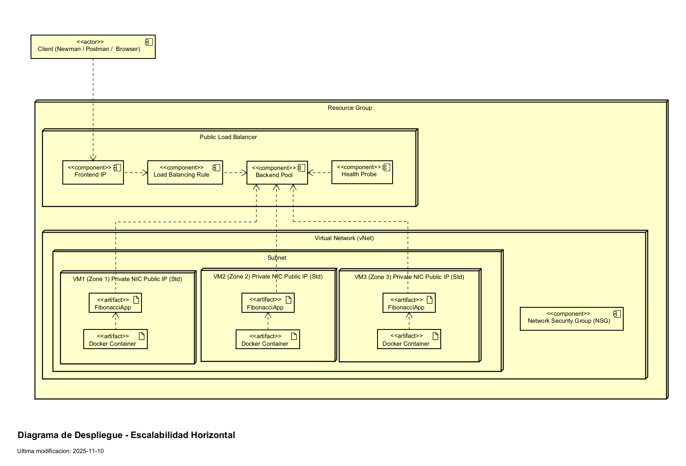

### **Bibliografia**
* <a id="comp"></a> [1] Mbender-Ms. (n.d.). Componentes de Azure Load Balancer. Microsoft Learn. https://learn.microsoft.com/es-es/azure/load-balancer/components
* <a id="sku"></a>[2] Mbender-Ms. (n.d.-b). SKU de Azure Load Balancer. Microsoft Learn. https://learn.microsoft.com/es-es/azure/load-balancer/skus
* <a id="out"></a>[3] Mbender-Ms. (n.d.-b). Reglas de salida en Azure Load Balancer. Microsoft Learn. https://learn.microsoft.com/es-es/azure/load-balancer/outbound-rules
* <a id="pool"></a>[4] Mbender-Ms. (n.d.-b). Inicio rápido: Creación de un equilibrador de carga interno: Azure Portal - Azure Load Balancer. Microsoft Learn. https://learn.microsoft.com/es-es/azure/load-balancer/quickstart-load-balancer-standard-internal-portal
* <a id="probe"></a>[5] Mbender-Ms. (n.d.-e). Sondeos de estado de Azure Load Balancer. Microsoft Learn. https://learn.microsoft.com/es-es/azure/load-balancer/load-balancer-custom-probe-overview
* <a id="rules"></a>[6] KodeKloud Notes. (n.d.). KodeKloud Notes. https://notes.kodekloud.com/docs/Updated-AZ-104-Microsoft-Azure-Administrator/Administer-Network-Traffic/Load-Balancer-Rules
* <a id="persistance"></a>[7] Persistencia de sesiones del equilibrador de carga. (n.d.). (C) Copyright 2025. https://docs.oracle.com/es-ww/iaas/Content/Balance/Reference/sessionpersistence.html
* <a id="virtual"></a>[8] Azure Virtual Network – Nube privada virtual | Microsoft Azure. (n.d.). https://azure.microsoft.com/es-es/products/virtual-network
* <a id="subnet"></a>[9] Yujiang. (n.d.). Plan Azure virtual networks. Azure Docs. https://docs.azure.cn/en-us/virtual-network/virtual-network-vnet-plan-design-arm
* <a id="address"></a>[10] Asudbring. (n.d.). Azure Virtual Network FAQ. Microsoft Learn. https://learn.microsoft.com/en-us/azure/virtual-network/virtual-networks-faq
* <a id="zones"></a>[11] Jasminemehndir. (n.d.). Compatibilidad con zonas de disponibilidad para Azure Automation. Microsoft Learn. https://learn.microsoft.com/es-es/azure/automation/automation-availability-zones
* <a id="regions"></a>[12] Elegir la región de Azure correspondiente | Microsoft Azure. (n.d.). https://azure.microsoft.com/es-es/explore/global-infrastructure/geographies/
* <a id="ip"></a>[13] Mbender-Ms. (n.d.-b). Direcciones IP públicas en Azure - Azure Virtual Network. Microsoft Learn. https://learn.microsoft.com/es-es/azure/virtual-network/ip-services/public-ip-addresses
* <a id="security"></a>[14] Asudbring. (n.d.-b). Introducción a los grupos de seguridad de red de Azure. Microsoft Learn. https://learn.microsoft.com/es-es/azure/virtual-network/network-security-groups-overview